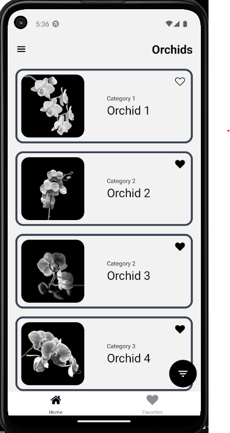
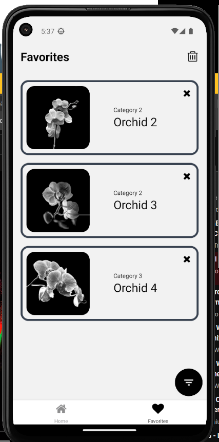

# Orchids App

The Orchids App is a React Native application built using Expo. It features a home screen that displays a collection of orchids and a favorites screen where users can store their favorite orchids. The app also includes the functionality to filter orchids by category. Here's how you can run and use the Orchids App.

## Installation

To run the Orchids App, follow these steps:

1. Clone the repository: `git clone https://github.com/huydeve/Orchids.git`
2. Navigate to the project directory: `cd Orchids`
3. Install the dependencies: `npm install`
4. Start the Expo development server: `npm start`
5. Use the Expo client app on your mobile device or an emulator to scan the QR code displayed in the terminal or the Expo DevTools interface.

## Screenshots

### Home Screen

The home screen displays a collection of orchids. Each orchid is represented by a card that includes its image, name, and category. Users can tap on an orchid to view its details.

### Favorites Screen

The favorites screen shows a list of orchids that the user has marked as favorites. Users can add or remove orchids from their favorites list by tapping the heart icon on an orchid card.

## Functionality

### Filter by Category

The Orchids App allows users to filter the displayed orchids by category. Users can choose from various categories such as Phalaenopsis, Cattleya, Dendrobium, and more. When a category is selected, only the orchids belonging to that category will be shown on the home screen.

### Favorite Orchids

Users can mark orchids as favorites by tapping the heart icon on an orchid card. The favorites are stored using AsyncStorage, allowing users to access their favorite orchids even after closing and reopening the app.

## Dependencies

The Orchids App utilizes the following dependencies:

- React Native: A JavaScript framework for building mobile applications.
- Expo: A set of tools and services for building, deploying, and running React Native apps.
- AsyncStorage: A simple, asynchronous, persistent key-value storage system used for storing the favorite orchids.
- NativeWind: uses Tailwind CSS as scripting language to create a universal style system for React Native. NativeWind components can be shared between platforms and will output their styles as CSS StyleSheet on web and StyleSheet.create for native.
- 
## Contributing

Contributions to the Orchids App are welcome! If you find any issues or have suggestions for improvements, please create a pull request or open an issue on the project repository.

## License

The Orchids App is open source and released under the [MIT License](LICENSE). Feel free to modify and use the code for your own projects.

---

Happy orchid browsing!
